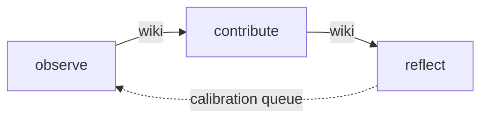

# agent-skills

[](https://code.claude.com/docs/en/skills)
[](CHANGELOG.md)
[](LICENSE)

**agent-skills** is a closed-loop learning system that observes a repository, plans contributions with type-tagged acceptance criteria, grades outcomes against predictions, and calibrates its own priors when they prove wrong. Each session leaves the knowledge base more accurate than it found it. Installable as a [Claude Code](https://docs.anthropic.com/en/docs/claude-code) plugin.

## Motivation

Coding agents that operate on real projects face two compounding problems. The obvious one is amnesia: each session rediscovers file ownership, re-reads CI configurations, and proposes changes that repeat earlier mistakes. The subtler and more dangerous problem is *confidently wrong recall* — when an agent does retain prior observations, those priors go stale. A contributor's review latency drifts from 3 hours to 18 hours; a CI workflow adds a required check; a codeowner rotates to a new area. An agent that acts on outdated assumptions without knowing they are outdated produces plans that fail in predictable, avoidable ways.

agent-skills addresses both problems through a closed-loop feedback system composed of four coordinated skills:

- **observe** surveys the repository and writes structured, quantitative findings into a per-project wiki — ownership areas, review latencies, CI gates, team dynamics.
- **contribute** consults the wiki before selecting work. It generates plans with type-tagged acceptance criteria — `[objective]` for tool-verifiable outcomes, `[proxy]` for measurable deltas, `[subjective]` for human judgment — then drafts a branch and hands the user the command to open the PR.
- **reflect** closes the feedback loop after a PR merges. It grades each acceptance criterion by type, compares planned outcomes against actual results, and appends calibration findings to a queue when observe's priors prove wrong.
- **agent-wiki** provides the persistent storage substrate that the other three skills share.

The calibration queue is the mechanism that turns this from a note-taking system into a learning system. When reflect detects that an observation was incorrect — a review latency baseline, a CI check list, a contributor's active area — it queues the drift finding. On the next session, contribute gates on an empty queue: it refuses to plan new work until observe has drained the queue and corrected its pages. This ensures the agent never compounds errors across sessions.

## Skill Coordination

The four skills do not invoke one another directly. They coordinate through wiki pages on disk, ensuring that all data handoffs persist across sessions.



Each skill reads from and writes to a shared, persistent wiki (agent-wiki). The dashed arrow closes the feedback loop: when reflect finds assumptions that proved incorrect, it queues calibration findings that observe incorporates on its next refresh. Contribute gates on an empty queue, so stale baselines are corrected before they influence new work.

## Installation

```
/plugin marketplace add pjordan/agent-skills
/plugin install agent-skills@pjordan-agent-skills
/reload-plugins
```

## Getting Started

The feedback loop runs in three phases across one or more sessions.

**1. Build context** -- Ask Claude to observe the repository. It reads git history and forge metadata, then writes structured wiki pages covering contributors, workflows, review policies, and team dynamics.

```
> observe this repo
```

**2. Ship a contribution** -- Ask Claude to pick work. It consults the wiki, generates a plan with type-tagged acceptance criteria, drafts a branch, and hands the user the command to open the PR.

```
> pick something to work on in the auth layer
> go with #214
```

**3. Learn from the outcome** -- After the PR merges, ask Claude to reflect. It compares plan against actual, grades acceptance criteria, and feeds calibration findings back into the wiki for the next session.

```
> reflect on PR #221
```

On the next `contribute`, the agent detects unconsumed calibration findings, refreshes the affected baselines, and picks work with corrected data. For a full annotated terminal session showing all four phases, see [docs/walkthrough.md](docs/walkthrough.md).

## Skills

| Skill | Description |
|-------|-------------|
| [agent-wiki](plugins/agent-skills/skills/agent-wiki/) | Persistent knowledge base. Maintains a per-project wiki of cross-referenced Markdown pages stored under `$CLAUDE_PLUGIN_DATA`. Data persists across sessions. |
| [observe](plugins/agent-skills/skills/observe/) | Repository context builder. Reads git history, forge metadata (GitHub via `gh`, Azure DevOps via `az`), and project documentation. Writes structured contributor, workflow, and review-policy pages into the wiki. Operates in read-only mode; the codebase is never modified. |
| [contribute](plugins/agent-skills/skills/contribute/) | Contribution workflow manager. Selects work items, generates plans with type-tagged acceptance criteria (`[objective]` for tool-verifiable, `[proxy]` for measurable deltas, `[subjective]` for human judgment), drafts local branches and PR descriptions, and iterates on review feedback. Scope-capped at 300 lines, 8 files, and 1 PR per invocation. Does not push to protected branches or open PRs autonomously; the user retains that control. |
| [reflect](plugins/agent-skills/skills/reflect/) | Post-merge learning loop. Compares plan artifacts against actual commits, reviews, and CI outcomes — grading objective criteria by tool evidence, proxy criteria by before/after delta, and subjective criteria as requiring human review. Produces retro pages and promotes recurring patterns into playbooks after 3+ retros surface the same lesson. Appends calibration findings to a queue that observe drains automatically. |

## Sample Wiki Output

After executing the feedback loop on a repository, the wiki contains pages such as:

```markdown
---
title: Retro — #221 token refresh race fix
type: retro
created: 2026-04-19
tags: [retro, auth, token-refresh]
related: [contributor-alice-chen, workflow-ci]
---

## Context
PR #221 (issue #214). Fixed a race condition in `AuthMiddleware` concurrent
token refresh. Branch: pjordan/214-fix-token-refresh-race.

## Acceptance criteria — outcome
- [x] Race condition no longer reproduces on concurrent refresh [objective: test]
      sha:d3f7a01
- [x] Regression test covers the concurrent-refresh path [objective: test]
      sha:a8c2e49

## Plan vs actual
Planned: 2 files, ~45 lines. Actual: 2 files, 44 lines. On target.
1 iterate round (lint fix). CI green after second push.

## Calibration findings
- **workflow-ci** | eslint config omits --fix flag documented in CONTRIBUTING.md
  | observed during CI lint failure on first push | [[retro-221-token-refresh]]
  | 2026-04-19
```

Each page uses YAML frontmatter and `[[wikilinks]]` for cross-referencing, with evidence citations using a structured grammar (`sha:`, `pr:`, `test:`, `delta:`, `human:`, `reason:`). The wiki resides at `$CLAUDE_PLUGIN_DATA/wikis/<project-key>/`, outside the repository working tree.

## Safety and Permissions

Safety in agent-skills is enforced architecturally, not by convention. The constraints below are hard gates — the system stops and surfaces the issue rather than proceeding in an unsafe state.

- **Read-only codebase access.** observe and reflect read repository contents and forge metadata but do not modify source files, `CLAUDE.md`, or `CONTRIBUTING.md`.
- **No autonomous social actions.** contribute does not open PRs, does not mention reviewers, does not post comments on other users' PRs, and does not push to `main`/`master` or protected branches.
- **Disjoint page ownership.** observe and reflect each write exclusively to their own page types (observe produces contributor, workflow, review-policy, and team-dynamics pages; reflect produces retro and playbook pages). This is a structural invariant, not a guideline — it ensures reflect can safely assert that observe's pages are stale without risk of having modified them itself, which is what makes the calibration queue correct.
- **Scope caps.** contribute enforces a hard limit of 300 lines changed, 8 files touched, and 1 PR per invocation. When any limit is about to trip, the agent pauses and asks the user before continuing.
- **Calibration gate.** contribute refuses to plan new work when the calibration queue is non-empty, preventing the agent from acting on priors that a previous session flagged as incorrect.
- **Local storage only.** All wiki data remains on the local machine under `$CLAUDE_PLUGIN_DATA`. No data is transmitted to external services apart from the standard forge CLI calls (`gh`, `az`) already in use.
- **Graceful degradation.** If `gh` or `az` is not installed or authenticated, skills continue to operate using git data alone and note which data sources were unavailable in a `## Limitations` section.

## Contributing

See [CONTRIBUTING.md](CONTRIBUTING.md) for guidelines on adding new skills or improving existing ones.

## Repository Layout

Each skill directory contains a `SKILL.md` file (agent instructions) and a `README.md` file (human-readable documentation). The plugin manifest is located at `plugins/agent-skills/.claude-plugin/plugin.json`.

## License

[MIT](LICENSE)
