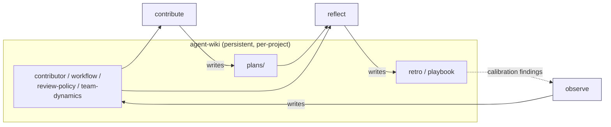

# agent-skills

[](https://code.claude.com/docs/en/skills)
[](CHANGELOG.md)
[](LICENSE)
[](https://github.com/pjordan/agent-skills/stargazers)
[](https://github.com/pjordan/agent-skills/issues)

Four skills that give coding agents a memory and a feedback loop across long-running development sessions — observe the repo, contribute work, reflect on what shipped, and compound the lessons in a per-project wiki. Installable as a [Claude Code](https://docs.anthropic.com/en/docs/claude-code) plugin.

## Why

Agents working autonomously over days rediscover the same things every session: who owns which paths, which CI checks gate which branches, that the "quick fix" from last Tuesday became a 900-line refactor. Each rediscovery costs real time and, worse, produces drive-by PRs and tagged maintainers nobody asked for.

agent-skills is one feedback loop, not four utilities. **observe** surveys the repo, team, and workflow into a per-project wiki. **contribute** reads that wiki before acting — picking work, planning, drafting PRs the user opens themselves — with hard safety rails on scope and social actions. **reflect** closes the loop after a PR ships: what drifted from plan, which observe priors look wrong, which patterns recur. The drift feeds back into observe's next refresh, so priors compound instead of decay. **agent-wiki** is the substrate the other three share.

## How the skills compound

The four skills never call each other. They coordinate on disk through `agent-wiki`, which means every handoff survives across sessions.



Arrows follow data flow: labeled `writes` where a skill authors pages, unlabeled where a skill consumes them. The dashed arrow closes the loop — `reflect`'s `## Calibration findings` sections feed into `observe refresh` when it recomputes baselines.

## Installation

In Claude Code, add the marketplace and install the plugin:

```
/plugin marketplace add pjordan/agent-skills
/plugin install agent-skills@pjordan-agent-skills
```

Then reload to activate:

```
/reload-plugins
```

## Usage

Once installed, skills are available automatically — Claude invokes them when relevant. You can also trigger a skill explicitly:

```
/agent-skills:agent-wiki init the wiki for this project
```

Or just ask naturally: "initialize the wiki", "ingest this finding", "lint the wiki".

## Skills

| Skill | Description |
|-------|-------------|
| [agent-wiki](plugins/agent-skills/skills/agent-wiki/) | Persistent, compounding knowledge base. Maintains a per-project wiki of cross-referenced markdown pages across sessions, stored under the user's Claude data directory. |
| [observe](plugins/agent-skills/skills/observe/) | Context-builder. Reads git, `gh`/`az` forge metadata, and project docs to file structured contributor/workflow/review-policy pages into agent-wiki. |
| [contribute](plugins/agent-skills/skills/contribute/) | Semi-autonomous contribution workflow. Picks work, plans, drafts a local branch + PR description, iterates on reviews. Hard safety rails; user opens the PR. |
| [reflect](plugins/agent-skills/skills/reflect/) | After-action learning loop. Reads plans, commits, reviews, and CI; writes retro and playbook pages into agent-wiki so priors compound across sessions. |

## Repo Structure

```
agent-skills/                            # Marketplace root
├── .claude-plugin/
│   └── marketplace.json                 # Marketplace definition
├── plugins/
│   └── agent-skills/                    # Plugin
│       ├── .claude-plugin/
│       │   └── plugin.json              # Plugin manifest
│       └── skills/
│           ├── agent-wiki/              # Persistent knowledge base
│           ├── observe/                 # Repo + team + workflow context-builder
│           ├── contribute/              # Semi-autonomous contribution workflow
│           └── reflect/                 # After-action learning loop
├── CONTRIBUTING.md
├── CHANGELOG.md
└── LICENSE
```

The repo is a marketplace containing one plugin. Each skill lives under `plugins/agent-skills/skills/` with a `SKILL.md` (agent instructions) and `README.md` (human overview).

## Contributing

See [CONTRIBUTING.md](CONTRIBUTING.md) for guidelines on adding new skills or improving existing ones.

## License

[MIT](LICENSE)
