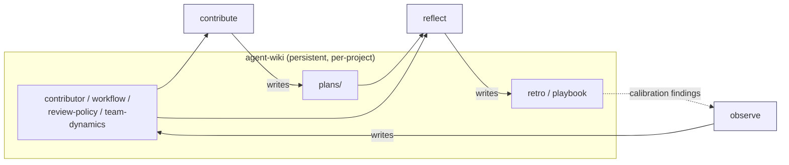

# agent-skills

[](https://code.claude.com/docs/en/skills)
[](CHANGELOG.md)
[](LICENSE)

Coding agents lack persistent memory across sessions. **agent-skills** addresses this by maintaining a structured, per-project wiki in which observations, plans, and lessons accumulate, enabling each session to build upon the knowledge of its predecessors. Installable as a [Claude Code](https://docs.anthropic.com/en/docs/claude-code) plugin.

## Motivation

Coding agents that operate on real projects over multiple sessions begin each session without knowledge of prior work. The agent rediscovers file ownership, re-reads CI configurations it has already parsed, and proposes changes that repeat earlier mistakes.

agent-skills addresses this limitation through a feedback loop composed of four coordinated skills:

- **observe** surveys the repository and writes structured findings into a per-project wiki.
- **contribute** consults the wiki before selecting work, planning changes, and drafting branches, while enforcing safety constraints that ensure the user retains control over PR creation.
- **reflect** completes the feedback cycle after a PR merges by comparing planned outcomes against actual results and documenting recurring patterns.
- **agent-wiki** provides the persistent storage substrate that the other three skills share.

Over successive sessions, observations become more accurate, plans become more precisely calibrated, and recurring mistakes are identified and corrected.

## Skill Coordination

The four skills do not invoke one another directly. They coordinate through wiki pages on disk, ensuring that all data handoffs persist across sessions.



The dashed arrow represents the feedback mechanism: when reflect identifies assumptions that proved incorrect, those calibration findings inform observe during its next refresh, allowing the wiki's baselines to improve over time.

## Installation

Add the marketplace source and install the plugin from within Claude Code:

```
/plugin marketplace add pjordan/agent-skills
/plugin install agent-skills@pjordan-agent-skills
/reload-plugins
```

All four skills become available immediately upon reload.

## Usage

Once installed, Claude invokes skills automatically when they are relevant to the current task. Skills may also be triggered explicitly:

```
/agent-skills:agent-wiki init the wiki for this project
```

Natural-language invocations are also supported -- for example, "initialize the wiki," "ingest this finding," or "lint the wiki."

## Skills

| Skill | Description |
|-------|-------------|
| [agent-wiki](plugins/agent-skills/skills/agent-wiki/) | Persistent knowledge base. Maintains a per-project wiki of cross-referenced Markdown pages stored under `$CLAUDE_PLUGIN_DATA`. Data persists across sessions. |
| [observe](plugins/agent-skills/skills/observe/) | Repository context builder. Reads git history, forge metadata (GitHub via `gh`, Azure DevOps via `az`), and project documentation. Writes structured contributor, workflow, and review-policy pages into the wiki. Operates in read-only mode; the codebase is never modified. |
| [contribute](plugins/agent-skills/skills/contribute/) | Contribution workflow manager. Selects work items, generates plans, drafts local branches and PR descriptions, and iterates on review feedback. Scope-capped at 300 lines, 8 files, and 1 PR per invocation. Does not push to protected branches or open PRs autonomously; the user retains that control. |
| [reflect](plugins/agent-skills/skills/reflect/) | Post-merge learning loop. Compares plan artifacts against actual commits, reviews, and CI outcomes. Produces retro and playbook pages so that lessons compound across sessions. Suggests retrospectives after merges but requires user confirmation before proceeding. |

## Sample Wiki Output

After executing observe on a repository, the wiki contains pages such as the following:

```
pages/
  contributor-alice.md      # Ownership areas, review latency, review volume
  workflow-ci.md            # CI checks, branch protection rules, release cadence
  review-policy.md          # Approval requirements, CODEOWNERS mapping
  team-dynamics.md          # Review network, PR cycle time, collaboration patterns
```

A contributor page contains quantitative data drawn from git and forge metadata:

```markdown
---
title: Contributor — Alice Chen
type: contributor
tags: [contributor, auth, payments]
related: [review-policy-main, team-dynamics]
---

## Ownership
| Path            | Commits (90d) | Blame share |
|-----------------|---------------|-------------|
| src/auth/       | 47            | 68%         |
| src/payments/   | 23            | 41%         |

## Review activity
- Median review latency: 3.2h (n=12 PRs)
- Reviews given (90d): 28
- Most-reviewed authors: Bob (9), Carol (7)

## Sources
- `git log --author="Alice Chen" --since="90 days ago" --name-only`
- `git blame` aggregated by path
- `gh pr list --state merged --json reviews`

## Last refreshed
2026-04-18 | HEAD: a1b2c3d | Commit count: 847
```

Each page uses YAML frontmatter and `[[wikilinks]]` for cross-referencing, with evidence citations linking to git SHAs and PR URLs. The wiki resides at `$CLAUDE_PLUGIN_DATA/wikis/<project-key>/`, outside the repository working tree.

## Safety and Permissions

- **Read-only codebase access.** observe and reflect read repository contents and forge metadata but do not modify source files, `CLAUDE.md`, or `CONTRIBUTING.md`.
- **No autonomous social actions.** contribute does not open PRs, does not mention reviewers, does not post comments on other users' PRs, and does not push to `main`/`master` or protected branches.
- **Disjoint page ownership.** observe and reflect each write exclusively to their own page types (observe produces contributor and workflow pages; reflect produces retro and playbook pages). agent-wiki handles general-purpose ingestion. This separation prevents write conflicts.
- **Local storage only.** All wiki data remains on the local machine under `$CLAUDE_PLUGIN_DATA`. No data is transmitted to external services apart from the standard forge CLI calls (`gh`, `az`) already in use.
- **Graceful degradation.** If `gh` or `az` is not installed or authenticated, skills continue to operate using git data alone and note which data sources were unavailable in a `## Limitations` section.

## Contributing

See [CONTRIBUTING.md](CONTRIBUTING.md) for guidelines on adding new skills or improving existing ones.

## Repository Layout

Each skill directory contains a `SKILL.md` file (agent instructions) and a `README.md` file (human-readable documentation). The plugin manifest is located at `plugins/agent-skills/.claude-plugin/plugin.json`.

## License

[MIT](LICENSE)
